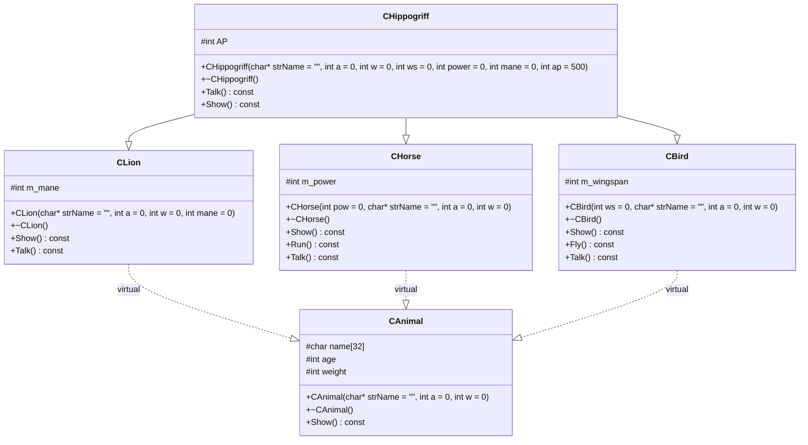

# CHippogriff UML

说明：
- 通过虚继承，CHippogriff 仅保留一份 CAnimal 子对象，避免重复构造和二义性。
- CHippogriff::Show() 按 Bird -> Horse -> Lion 顺序聚合展示，再输出 Attack Power。
- CHippogriff::Talk() 直接复用 CLion::Talk()，根据有无鬃毛区分雄狮/雌狮行为。
