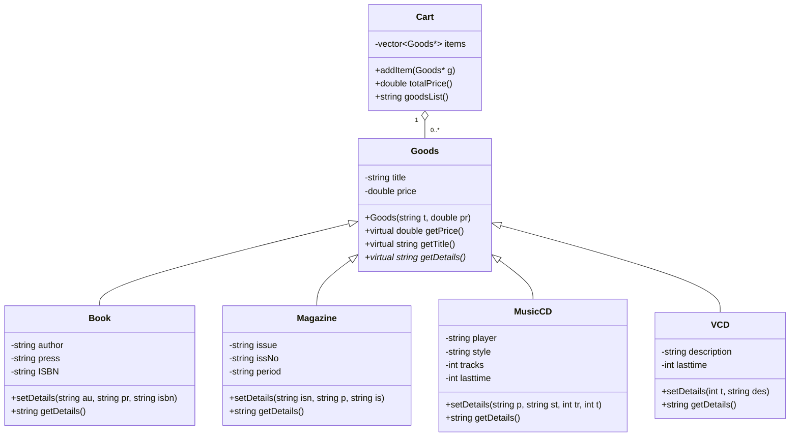

# Homework9 UML

```mermaid
classDiagram
    class Goods {
        -string title
        -double price
        +Goods(string t, double pr)
        +virtual double getPrice()
        +virtual string getTitle()
        +virtual string getDetails()*
    }

    class Book {
        -string author
        -string press
        -string ISBN
        +setDetails(string au, string pr, string isbn)
        +string getDetails()
    }

    class Magazine {
        -string issue
        -string issNo
        -string period
        +setDetails(string isn, string p, string is)
        +string getDetails()
    }

    class MusicCD {
        -string player
        -string style
        -int tracks
        -int lasttime
        +setDetails(string p, string st, int tr, int t)
        +string getDetails()
    }

    class VCD {
        -string description
        -int lasttime
        +setDetails(int t, string des)
        +string getDetails()
    }

    class Cart {
        -vector~Goods*~ items
        +addItem(Goods* g)
        +double totalPrice()
        +string goodsList()
    }

    Goods <|-- Book
    Goods <|-- Magazine
    Goods <|-- MusicCD
    Goods <|-- VCD
    Cart "1" o-- "0..*" Goods
```
